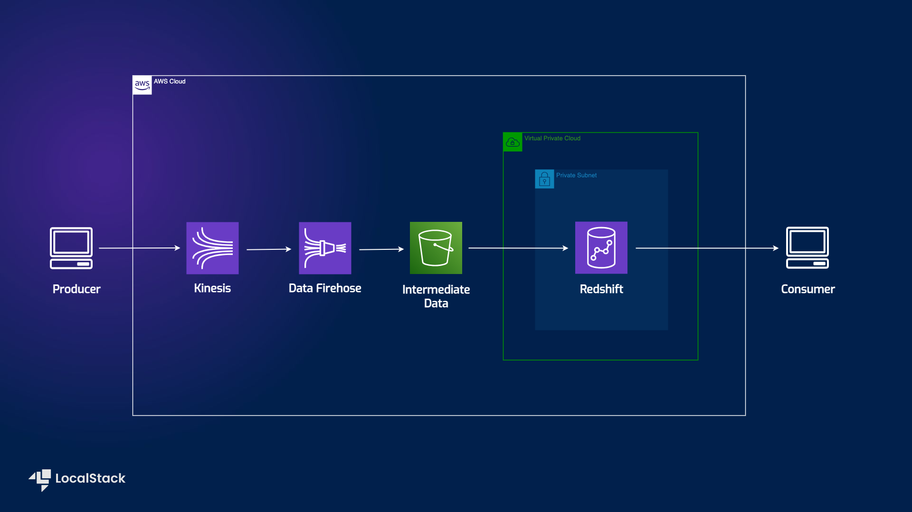

# CDK deployment of a Kinesis Event Stream to Data Firehose to Redshift data pipeline
LocalStack sample CDK app deploying a Kinesis Event Stream to Data Firehose to Redshift data pipeline, including sample producer and consumer

| Key          | Value                                                                                                |
| ------------ | ---------------------------------------------------------------------------------------------------- |
| Environment  |                                                                                    |
| Services     | Kinesis Data Stream, Firehose, S3, Redshift                                                          |
| Integrations | CDK                                                                                                  |
| Categories   | BigData                                                                                  |
| Level        | Intermediate                                                                                         |
| GitHub       | [Repository link](https://github.com/localstack-samples/sample-cdk-kinesis-firehose-redshift)        |




# Prerequisites

## Required Software
- Python 3.11
- node >16
- Docker
- AWS CLI
- AWS CDK
- LocalStack CLI

<details>
  <summary>if you are on Mac:</summary>

    1. install python@3.11
        
        ```bash
        brew install pyenv
        pyenv install 3.11.0
        ```

    2. install nvm and node >= 16
    
        ```bash
        brew install nvm
        nvm install 20
        nvm use 20
        ```
    3. install docker

        ```bash
        brew install docker
        ```

    4. install aws cli, cdk

        ```bash
        brew install awscli
        npm install -g aws-cdk
        ```

    5. install localstack-cli and cdklocal
        
        ```bash
        brew install localstack/tap/localstack-cli
        npm install -g aws-cdk-local
        ```
</details>


## Setup development environment
Clone the repository and navigate to the project directory.
    
    ```bash
    git clone git@github.com:localstack-samples/sample-cdk-kinesis-firehose-redshift.git
    cd sample-cdk-kinesis-firehose-redshift
    ```

Copy `.env.example` to `.env` and set the environment variables based on your target environment.
You can use the sample user and password and names, or set your own.


Create a virtualenv using python@3.11 and install all the development dependencies there:

```bash
pyenv local 3.11.0
python -m venv .venv
source .venv/bin/activate
pip install -r requirements-dev.txt
```    


# Deployment
- Configure the AWS CLI
- Set the environment variables in the .env file based on .env.example

## Deploy the CDK stack manually
Against AWS

- unset the .env variable "AWS_ENDPOINT_URL"
by uncommenting the line in the `.env` file and reloading it.
If you run the debugger, you will also need to uncomment the line in `.vscode/launch.json`
  
```bash
cdk synth
cdk bootstrap
cdk deploy KinesisFirehoseRedshiftStack1
python -m utils/prepare_redshift.py
cdk deploy KinesisFirehoseRedshiftStack2
```

Against LocalStack

- set the .env variable "AWS_ENDPOINT_URL" to "http://localhost:4566"

```bash
localstack start
cdklocal synth
cdklocal bootstrap
cdklocal deploy KinesisFirehoseRedshiftStack1
python -m utils/prepare_redshift.py
cdklocal deploy KinesisFirehoseRedshiftStack2
```

## Deploy the CDK stack using the Makefile
Against AWS

- unset the .env variable "AWS_ENDPOINT_URL" 
by uncommenting the line in the `.env` file and reloading it.
If you run the debugger, you will also need to uncomment the line in `.vscode/launch.json`

```bash
make deploy-aws
```

Against LocalStack

- set the .env variable "AWS_ENDPOINT_URL" to "http://localhost:4566"

```bash
localstack start
make deploy-localstack
```

# Testing

## Run the tests either against AWS or LocalStack
```bash
make test
```

This will run a pytest defined in `tests/test_cdk.py`, put sample data into the Kinesis stream and check if the data is being ingested into the Redshift table.
If you are running the tests against LocalStack, you need to restart the LocalStack container for consecutive runs, since the Redshift table is not being cleaned up after the tests.
The same is true for the AWS deployment, you can manually clean up the Redshift table after the tests, or re-deploy the stack.

## Github Actions CI tests
The github actions workflow defined in `.github/workflows/main.yaml` will install the required dependencies, start a LocalStack containerdeploy the infrastructure aginast LocalStack and run the test.
To set up the workflow, you need to create an environment and set the variables and secrets from you `.env` file.
The workflow will run on every push to the main branch.

# Interact with the deployed resources

## Start sample kinesis producer
set the endpoint url and port acording to your target.
```bash
make start-producer
```
This will run the producer defined in `utils/producer.py` in the background and start sending new data to the kinesis stream, each 10 seconds.

## Read data from Redshift
Open the Jupyter Notebook (simples way if you are on VSCode is using the extension: https://code.visualstudio.com/docs/datascience/jupyter-notebooks) and run the cells to read data from Redshift.
As new data from the mock Kinesis producer is being sent to the Kinesis stream, the data will be automatically ingested into the Redshift table.
You can re-run the cells in the Jupyter Notebook to see the data being updated in real-time.

# Contributing
We appreciate your interest in contributing to our project and are always looking for new ways to improve the developer experience.
We welcome feedback, bug reports, and even feature ideas from the community. Please refer to the contributing file for more details on how to get started.
